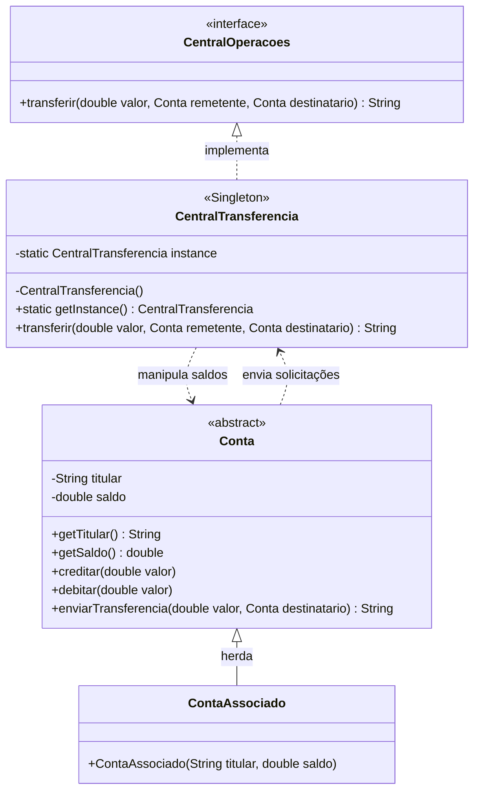

diagrama:

```mermaid
classDiagram
    class CentralOperacoes {
        <<interface>>
        +transferir(double valor, Conta remetente, Conta destinatario) String
    }

    class CentralTransferencia {
        <<Singleton>>
        -static CentralTransferencia instance
        -CentralTransferencia()
        +static getInstance() CentralTransferencia
        +transferir(double valor, Conta remetente, Conta destinatario) String
    }

    class Conta {
        <<abstract>>
        -String titular
        -double saldo
        +getTitular() String
        +getSaldo() double
        +creditar(double valor)
        +debitar(double valor)
        +enviarTransferencia(double valor, Conta destinatario) String
    }

    class ContaAssociado {
        +ContaAssociado(String titular, double saldo)
    }

    CentralOperacoes <|.. CentralTransferencia : implementa
    Conta <|-- ContaAssociado : herda
    Conta ..> CentralTransferencia : envia solicitações
    CentralTransferencia ..> Conta : manipula saldos

```
